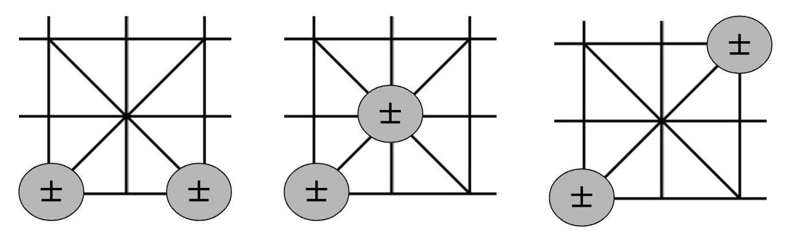

# Chinese Chess Straight Protocol

專門為肛之棋士們設計的一個簡短且好記的象棋走步通訊協定。 
由於編碼方式為 23456，所以用 Straight(撲克中順子的意思)命名。

## 緣由與動機

從象棋作弊的新聞中得到啟發，思考該如何讓震動次數最少，希望可以保護肛之棋士們的括約肌。

## 編碼方式

區分相同棋種方式為從右至左，先遇到的則定為第一個，如果在同一條線上則順序為從上至下。

走步使用順時針紀錄。

### 將、士

`將`為`0`、`士`為`1`

第 1 個 bit 表示棋子 
後 2 個 bit 表示走步 
總共 3 個 bit 

例：`001` -> `0` `01` -> `將`的第`2`種走步

因為兩個士沒有辦法同時往同個方向移動，所以只要知道走步就能確定是哪一隻士。

### 馬

### 象、卒

### 車、炮
