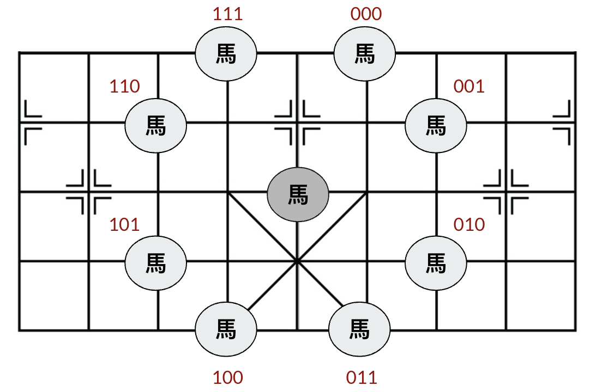

# Chinese Chess Straight Protocol

專門為肛之棋士們設計的一個簡短且好記的象棋走步通訊協定。 
由於編碼方式為 23456，所以用 Straight(撲克中順子的意思)命名。

詳細可以參考[猴子也能懂的電腦對局](https://ithelp.ithome.com.tw/users/20169302/ironman/7684)系列文中的[Day28 從象棋比賽作弊事件探討資料傳輸與資料結構](https://ithelp.ithome.com.tw/articles/10367074)與[Day29 什麼？肛門也能下棋！](https://ithelp.ithome.com.tw/articles/10367432)

## 免責聲明

本通訊協定（以下簡稱“協定”）僅供學術研究和娛樂用途。 
本協定的創建者和貢獻者不對使用本協定所引發的任何直接或間接後果負責。 
本協定不鼓勵、支持或容忍任何形式的不誠實行為，包括但不限於作弊或欺詐。 
使用本協定的個人或團體應自行承擔相應的法律和道德責任。

## 緣由與動機

從象棋作弊的新聞中得到啟發，思考該如何讓震動次數最少，希望可以保護肛之棋士們的括約肌。

## 編碼方式

區分相同棋種方式為從右至左，先遇到的則定為第一個，如果在同一條線上則順序為從上至下。

走步使用順時針紀錄。

### 將、士

`將`為`0`、`士`為`1`

第 1 個 bit 表示棋子 
後 2 個 bit 表示走步 
總共 3 個 bit 

依照順時針的順序往下走，依序為： 
`00`：往前(`士`為往右上) 
`01`：往右(右下) 
`10`：往下(左下) 
`11`：往左(左上)

例：`001` -> `0` `01` -> `將`的第`2`種走步(往右)

下圖為兩隻士的所有位置對應情況，因為兩個士沒有辦法同時往同個方向移動，所以只要知道走步就能確定是哪一隻士。

### 馬

第一個`馬`為`0`、第二個`馬`為`1`

區分相同棋種方式為從右至左，先遇到的則定為第一個，如果在同一條線上則順序為從上至下，以下皆使用這種方式辨認棋子。

第 1 個 bit 表示棋子 
後 3 個 bit 表示走步 
總共 4 個 bit

下圖為走步編碼方式，一樣是順時針的方式相當好記：

例：`1011` -> `1` `011` -> 第二個`馬`的第`4`種走步(往 5 點鐘方向走)

### 象、卒

`象`：`000` `001` 
`卒`依序為：`010` `011` `100` `101` `110`

前 3 個 bit 表示棋子 
後 2 個 bit 表示走步 
總共 5 個 bit

走步跟將、士將同 
`00`：往前(`象`為往右上) 
`01`：往右(右下) 
`10`：往下(左下) 
`11`：往左(左上)

例：`01101` -> `011` `01` -> 第二個`卒`的第`2`種走步(往右)

### 車、炮

車：`00` `01` 
炮：`10` `11` 

前 2 個 bit 表示棋子 
後 4 個 bit 表示走步 
總共 6 個 bit

根據車、炮在棋盤上的位置能走的格數也不一樣，所以只表達往前跟往右，超出棋盤的部分就從棋盤另一端開始繼續數。

如下圖車往右 7 的話，其實就是往左 2 格：

`0000` ~ `0111` 代表往右 1 格到 8 格 
`1000` ~ `1111` 代表往前 1 格到 8 格

因為車、炮共有 17 種走步(直 9 橫 8)，為了多出的一種走步就要增加一個 bit 實在是有點太浪費了，所以就將第 17 種走步列為特殊情況。 
**特例情況：2 個 bit，直接表示該棋子的第 17 種走步，這邊將第 17 種走步設為往前 9 格。**

例：`000001` -> `00` `0001` -> 第一個`車`的第`2`種走步(往右 2) 
`10` -> 第一個`炮`的第`17`種走步(往前 9)

當只有收到兩次震動時，就是特殊情況，2 碼就代表棋子，因為走步已經固定了。

例：`000001` -> `00` `0001` -> 第一個`車`的第`2`種走步 
`10` -> 第一個`炮`的第`17`種走步

這樣**震動次數最多就為 6 次**，而且非常的好記，只要記得各棋種是幾碼，回想一下他的棋子數量與走步方式就知道怎麼去切割，**歡迎各位肛之棋士採用此編碼**，**能有效保護您的括約肌**。
